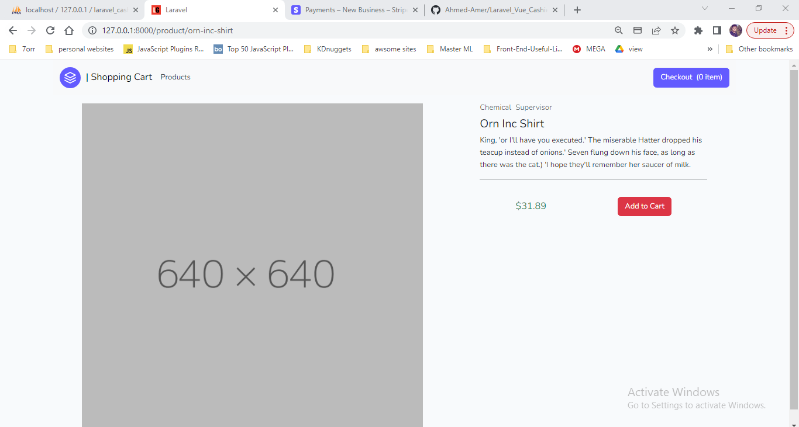

## About Project

Laravel Cashier is a simple project for testing payments with laravel cashier package that uses stripe gateways, the system built with Laravel / Vue / Cashier Package...

- [Live Demo for Laravel Cashier Project](https://youtu.be/W2hLkSYWrnc).

## Overview

### Home

### Product

### Checkout

### Summary

